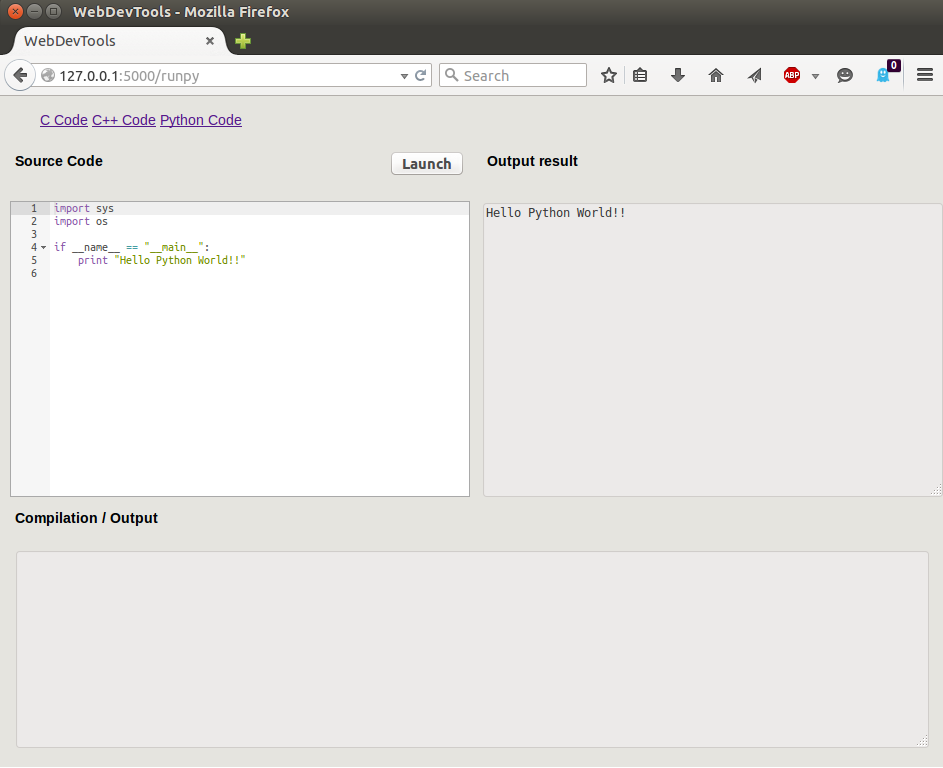
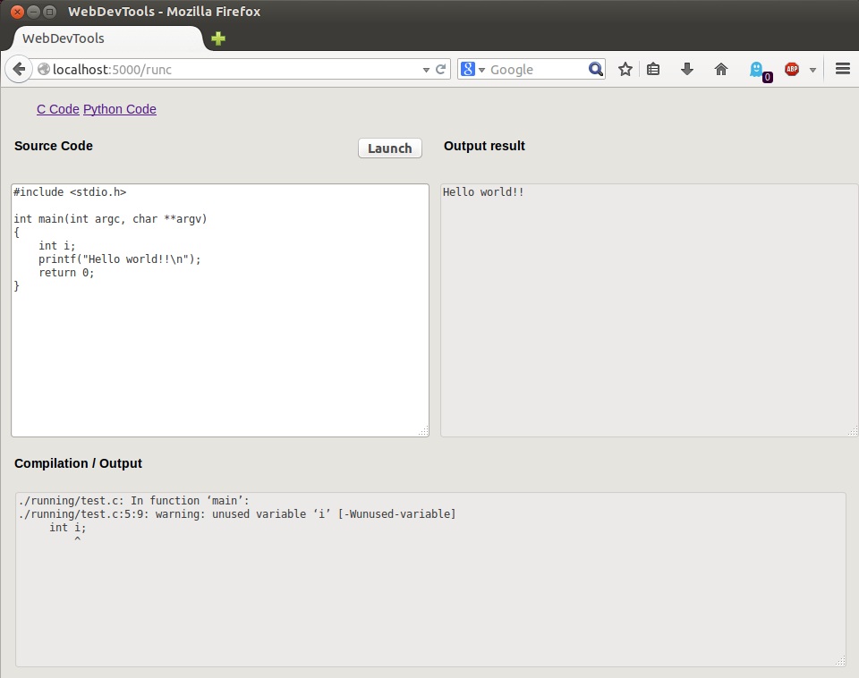

CodeLauncher
============

Сервер Flask Python запускает код C/C++ и код Python онлайн.

Это простой, легкий сервер Flask, который позволяет вам быстро запускать код C или код Python.
Он использует только HTML5 и CSS3. Javascript не нужен, но если активирован редактор `Ace <http://ace.c9.io>` _ всегда доступен.

Единственная зависимость - Flask.

Ниже приведены скриншоты.

Это программное обеспечение создано для вас, если вы ищете:

- что-то простое для написания базового кода
- что-то унифицированное для запуска базовых программ C и Python из исходного кода (с использованием одного клика)
- не создавать файл, компилировать, используя терминал, ни с помощью интерпретатора
- быстрый результат с использованием одного клика на кнопке
- нет рекламы и инструмента с открытым исходным кодом
- с помощью веб-браузера
- работа в локальном хосте
- не нужен javascript (если только не нужен более эффективный редактор кода)
- настраиваемый
- нет ограничений безопасности

**WARNING: Будьте осторожны, это предназначено для запуска в локальном режиме, поскольку нет изолированной программной среды, нет управления безопасностью.**

Как использовать
----------

Легкий способ - клонировать его и использовать его через virtualenv:

.. code-block:: sh

    $ git clone https://github.com/Dzokaredevil/CodeLauncher.git  # or git@github.com:Dzokaredevil/CodeLauncher.git
    $ cd codelauncher

    $ virtualenv env
    $ . env/bin/activate
    $ pip install Flask

Запуск сервера:

.. code-block:: sh

    $ python webdev.py

Затем посетите веб-браузер URL: `http://127.0.0.1:5000`.

Скриншот
----------

.. _screenshots:

- Редактор Ace используется, когда активирован Javascript:

- Когда Javascript не активирован, основное текстовое поле:

